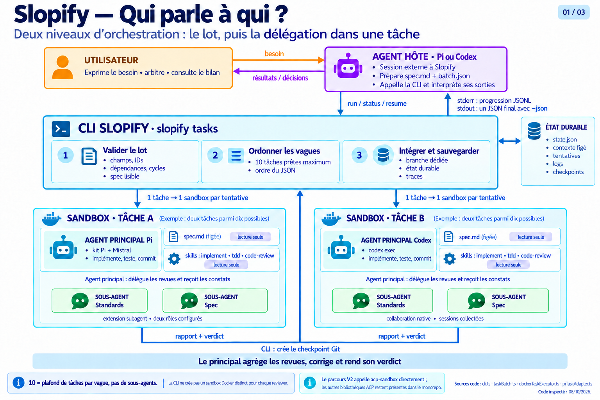
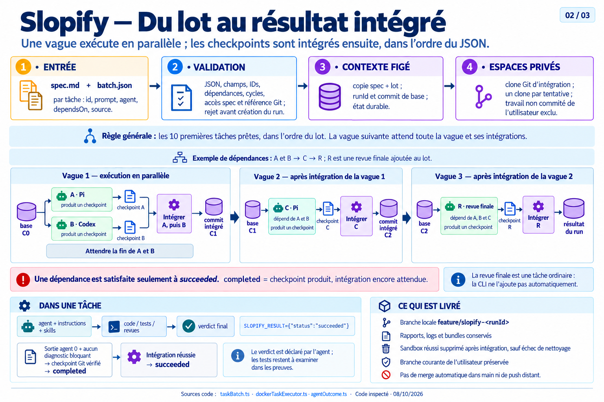
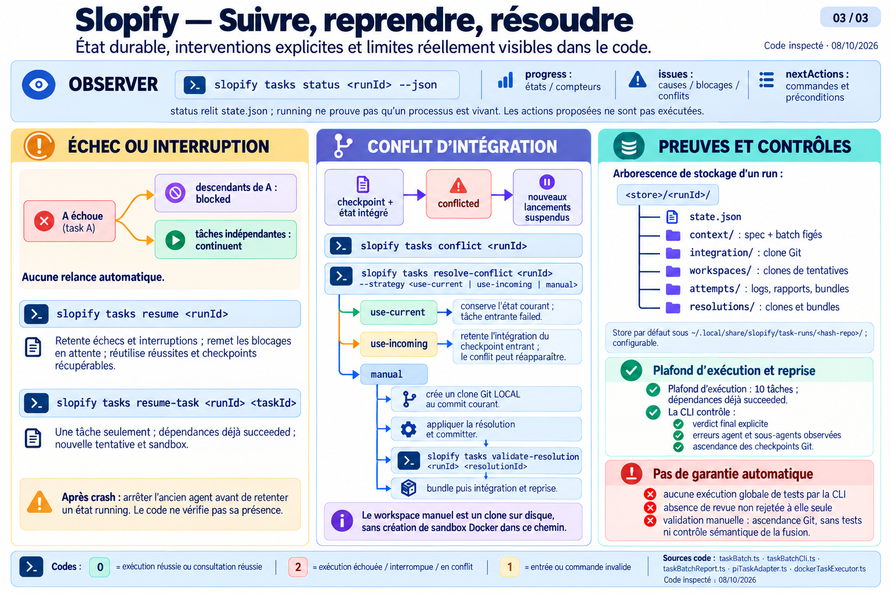

# Slopify V2

Slopify reçoit une spec et un lot JSON préparés à l’extérieur, puis exécute les
tâches avec Pi ou Codex dans des sandboxes Docker distincts. Les dix premières
tâches prêtes dans l’ordre du JSON forment une vague. Toutes partent du même commit
intégré ; la vague suivante attend leur fin et l’intégration des réussites dans
l’ordre du JSON. Un échec bloque seulement ses descendants, sans relance automatique.

## Fonctionnement en images

Les trois planches ci-dessous décrivent le fonctionnement observé dans le code.
Une vague peut exécuter jusqu’à **10 tâches prêtes en parallèle**, chacune avec
son agent principal et sa sandbox. Les sous-agents de revue ne sont pas comptés
dans ce plafond.

### 1. Utilisateur, agent hôte, CLI et sous-agents



### 2. Du lot au résultat intégré



### 3. Suivi, reprises et conflits



Voir les [sources du code et les précisions de lecture](docs/images/slopify/README.md).

## Installation et utilisation

Prérequis : Node.js >= 22.19, npm, Docker Sandboxes (`sbx`), agents Pi/Codex
configurés et skills `implement`, `tdd`, `code-review` disponibles en lecture seule.

```bash
npm ci
npm run build
npm link -w slopify
slopify --help
slopify init --host all --yes
slopify tasks run batch.json --cwd /chemin/du/depot --json
slopify tasks status <run-id> --cwd /chemin/du/depot --json
slopify tasks resume <run-id> --cwd /chemin/du/depot --json
```

Sans installation globale : `npm run slopify -- tasks run batch.json --json`.

`slopify init` prépare uniquement le projet ciblé (`--cwd`) pour la V2 : exemples
dans `.scratch/slopify/`, conventions locales et skill hôte Pi/Codex. `--host`
accepte `pi`, `codex` ou `all`; `--yes` choisit `all` par défaut. Une relance
réécrit tous les fichiers possédés par init, sans sauvegarde, et préserve les autres.
Le choix d'hôte reste interactif sans `--host`, mais le pull project-scope de
`mattpocock/skills` est toujours automatique et non interactif. Il est géré par la
CLI `skills`; son échec est un avertissement. Init ne consulte ni ne modifie le
store global `sbx`.

Cette commande adapte l'intention de l'issue historique #45 au contrat V2 : aucun
asset `.acp`, Vibe ou Copilot et aucune restauration des anciennes commandes. Les
ADR historiques restent inchangées.

Le lot contient `specFile` et `tasks` ; chaque tâche fournit `id`, `prompt`,
`agent` (`pi` ou `codex`), `dependsOn` et `source`. Slopify valide tout le lot
avant lancement et transmet les prompts sans réécrire les instructions de skills.
Il conserve l’état durable, les rapports et la branche `feature/slopify-<run-id>`
sans modifier la branche de travail de l’utilisateur.

Codes : **0** pour une exécution ou consultation réussie, **2** pour une exécution
échouée, interrompue ou en conflit, **1** pour une erreur d’entrée ou de commande.
Les anciens `list`, `run <pipeline> <prompt>` et `resume --agent` sont retirés.

`run` annonce son identifiant et son avancement sur stderr. `tasks status` fournit
les compteurs, les causes d’échec et blocages, les rapports et les commandes utiles
pour la suite, en texte ou JSON.

Voir le [contrat JSON et les commandes V2](slopify/README.md) et le
[guide Pi](docs/agents/coordinator-pi.md) pour les reprises et conflits.

## Monorepo et validation

`slopify` expose uniquement les lots V2. Les bibliothèques `acp-pipeline`,
`acp-runtime`, `acp-sandbox`, `acp-workspace` et leurs tests hérités sont conservés.
Les configurations historiques nécessaires aux tests vivent dans leurs fixtures.

```bash
npm run build
npm test
node slopify/smoke/task-batch.mjs
```

L’essai Docker utilise un dépôt temporaire et conserve ses preuves dans le chemin
affiché. Il nécessite les accès aux fournisseurs des deux agents.
